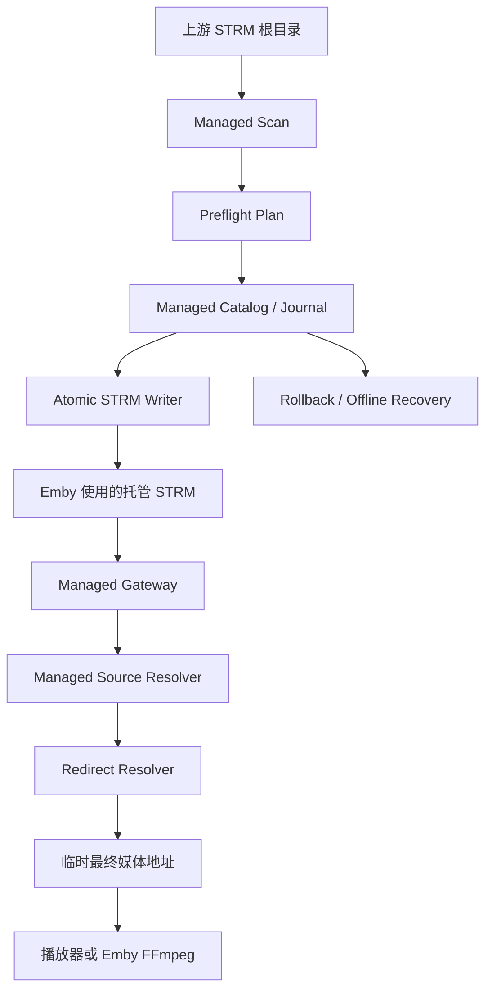
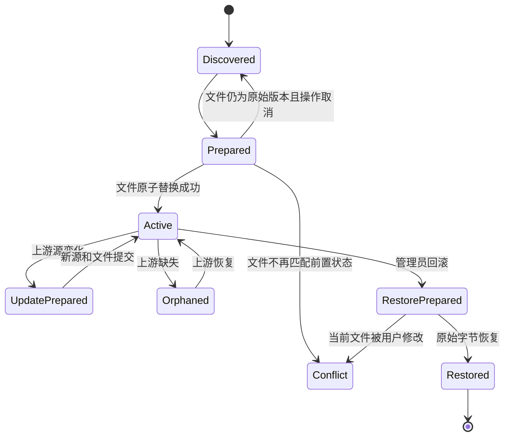
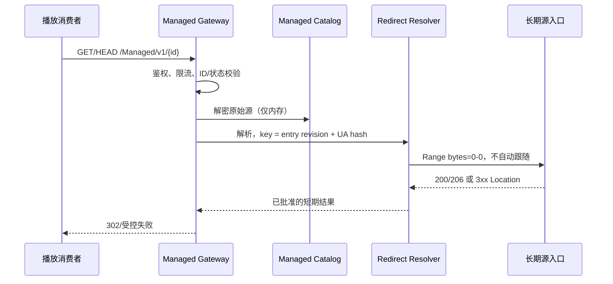

# STRM Bridge 批量托管模式完整设计方案

## 1. 文档信息

- 功能名称：STRM Bridge 批量托管模式（Managed STRM Mode）
- 所属项目：`Emby.StrmBridge`
- 文档状态：详细设计，尚未实现
- 适用阶段：现有提取/播放功能之后的可选 M5
- 目标宿主：Emby Server 4.9.x，首要实机版本 4.9.5.0
- 目标框架：沿用插件 `netstandard2.1`
- 设计日期：2026-08-21

本设计是一项可选扩展，不表示当前发布包已经具备修改或生成 STRM 的能力。启用前必须完成第 25 节的实机可行性门槛。

## 2. 背景与结论

当前播放桥接通过 `IMediaSourceProvider` 增加候选源，但 Emby 的公开接口没有 Provider 优先级保证。某些播放链路仍会选择原始静态 STRM 源，导致候选桥接源存在但没有被消费。

批量托管模式采用不同路径：把媒体库实际读取的 STRM 内容改为插件自己的稳定 HTTP(S) 入口。这样 Emby 内置静态源本身就是桥接入口，不再依赖客户端选择备用媒体源。插件收到请求后，读取受保护目录中的原始源记录，按现有安全策略解析短期重定向并返回 302；媒体正文仍由播放器或 Emby FFmpeg 直接读取。

对“上游目录程序生成长期有效入口、STRM 数量很多、文件已保存到本地”的场景，本方案可行。文件数量不是核心瓶颈，因为每个 STRM 很小；真正需要解决的是：

1. 不能要求管理员逐个编辑。
2. 不能没有预检查就覆盖。
3. 必须在崩溃、取消、上游重新生成、插件损坏和卸载时可恢复。
4. 原始 URL 含长期能力凭据时不得写入插件日志、普通配置或明文备份。
5. 托管入口必须对通用客户端和服务端 FFmpeg 都可达。

## 3. 官方行为依据与限定

根据 OpenList 当前官方文档：

- STRM 驱动可用 `Site URL` 生成以站点 URL 为前缀的 `/d/...` 地址，并可把生成结果保存到本地。
- 本地保存支持新增、更新和同步模式；更新模式会覆盖既有 STRM 内容，同步模式还会删除上游已不存在的本地文件。
- 递归生成需要显式扫描；文档未承诺定时监听所有远端变化。
- 直链有效期配置为 `0` 表示 OpenList 入口不因该时间配置过期；只有带密码的路径才使用相应 `sign` 过期检查。

由此得出以下设计限定：

1. 把 OpenList `/d/...` 入口视为长期源记录，但仍把其返回的 CDN `Location` 视为短期结果。
2. 不解析、生成或续签任何厂商私有查询参数。
3. 不假定上游永远不会改写本地 STRM。
4. 生产代码只实现通用“上游 STRM 根目录”协议，不出现厂商域名、路径前缀或签名字段分支。
5. OpenList 只作为兼容性样例；同样设计适用于任何生成单条 HTTP(S) URL 的工具。

## 4. 目标、非目标与成功标准

### 4.1 必须实现

- 批量发现所选根目录中的合规 STRM。
- 在实际写入前生成只读预检报告。
- 以稳定、不可猜测的托管入口替换或镜像原 STRM。
- 把原始 STRM 内容加密保存在插件数据目录。
- 所有单文件变更使用同目录临时文件、刷盘和原子替换。
- 使用可恢复事务日志处理“目录记录已写、文件未写”及其反向状态。
- 可暂停、取消、继续和重试，不重复生成有效记录。
- 支持按根目录、批次或单项回滚。
- 上游内容变化后可对账并更新加密源记录。
- 删除行为默认进入隔离区，不直接删除媒体目录中的文件或元数据。
- 托管入口经现有重定向安全策略解析，不代理媒体正文。
- 提取任务理解托管源，避免对自身 Gateway 形成递归。
- 卸载或禁用前明确提示仍有多少托管项，提供紧急恢复方法。

### 4.2 明确不实现

- 不调用特定目录程序或网盘 API。
- 不扫描云盘、不生成厂商签名、不刷新永久链接。
- 不代理、缓存或转码媒体正文。
- 不修改 Emby 数据库表、FFmpeg 命令或宿主私有方法。
- 不自动搬迁 NFO、图片、字幕和其他媒体旁文件。
- 不在未确认的情况下删除目录、回滚用户主动修改的文件或覆盖冲突。
- 不把稳定托管 ID 描述为短期票据；它具有不同的风险模型。
- 不承诺在插件未加载时托管 STRM 仍可播放。

### 4.3 成功标准

- 采用托管模式后，Emby 暴露的默认静态 STRM 源就是 Bridge URL。
- 不需要客户端从多个媒体源中选择插件候选源。
- 10 万 STRM 的扫描、预检和对账保持 O(n)，内存和日志有明确上限。
- 任意已提交批次都能在不依赖远程源的情况下恢复原始 STRM 内容。
- 注入崩溃、取消或磁盘满后，不出现既无法播放又无法恢复的未知状态。
- 插件自有日志、活动记录和普通配置中不存在原始 URL、查询参数、文件名或稳定托管 ID。

## 5. 推荐部署拓扑

### 5.1 模式 A：双根镜像，推荐

```text
上游生成根目录（只读输入）
    /source-root/**/*.strm
              │
              │ 预检、加密登记、对账
              ▼
Emby 托管根目录（插件写入）
    /managed-root/**/*.strm  ->  https://<配置的服务地址>/StrmBridge/Managed/v1/<opaque-id>
              │
              ▼
        Emby 媒体库
```

特点：

- 上游生成工具可继续使用更新或同步模式，不会覆盖 Emby 实际使用的托管文件。
- 原始 STRM 仍保留在上游根目录，是最直接的灾难恢复来源。
- Emby 的 NFO、图片和字幕留在托管根目录，由 Emby 自己管理。
- 插件只镜像 `.strm`，不复制其他文件。
- 上游删除只把托管项标记为孤立；默认等待管理员确认，不删除托管目录或旁文件。

这是新部署和大规模库的推荐模式。

### 5.2 模式 B：原位接管，兼容既有库

插件在现有 Emby 媒体库内原子替换 STRM 内容，并把原内容加密登记。适合已经在同一目录生成大量 NFO、图片和字幕，不方便迁移媒体库路径的部署。

约束：

- 根目录不能同时作为无人值守的上游更新/同步输出，除非启用并验证对账任务。
- 最佳做法是把上游后续输出改到独立输入根目录，再由插件对账到现有 Emby 根目录。
- 原位模式扩大 Emby 服务账号的写权限，必须由管理员显式启用。
- 插件卸载前必须先回滚，或保留离线恢复所需的密钥和目录。

### 5.3 选择规则

| 条件 | 推荐模式 |
| --- | --- |
| 新库、可调整 Emby 路径 | 双根镜像 |
| 现有库已有大量本地元数据 | 原位接管后把上游输出迁到独立根 |
| 上游会周期性覆盖/同步 | 双根镜像 |
| 无法给插件媒体目录写权限 | 不启用托管模式 |
| 无法保证插件长期在线 | 保留原库并采用双根镜像 |

## 6. 总体架构



### 6.1 组件职责

| 组件 | 职责 |
| --- | --- |
| `ManagedRootRegistry` | 保存已批准的输入根、托管根和模式，不接受任意请求传入路径 |
| `ManagedScanner` | 有界枚举、基础文件安全检查、形成预检统计 |
| `ManagedPlanStore` | 保存短期预检计划及文件前置指纹，防止“看的是 A、写的是 B” |
| `ManagedCatalog` | 保存托管项状态、加密源内容、路径密文和逻辑指纹 |
| `ManagedJournal` | 追加事务阶段、刷盘、崩溃恢复和压缩 |
| `ManagedFileWriter` | 同目录随机临时文件、权限继承、刷盘和原子替换 |
| `ManagedSourceResolver` | 把托管 ID 解密为原始 URL，只在请求内存中暴露 |
| `ManagedGatewayService` | 认证/能力校验、限流、调用重定向解析器并返回 302 |
| `ManagedReconciler` | 对比上游、目录记录和托管文件，分类变化与冲突 |
| `ManagedRollbackService` | 按批次或根目录恢复原始字节，不覆盖冲突文件 |
| `ManagedRecoveryExport` | 生成加密、可离线使用的恢复包 |

## 7. 托管 URL 设计

### 7.1 URL 形态

```text
https://<administrator-configured-base>/StrmBridge/Managed/v1/<managed-id>
```

- `administrator-configured-base` 必须由管理员设置，不能硬编码服务器名、端口或反向代理前缀。
- `managed-id` 为 256 位密码学随机数，使用无填充 Base64Url 或等价编码。
- URL 不包含原文件路径、ItemId、库 ID、原始 host、查询参数或签名。
- 插件只接受固定版本、固定段数和固定长度的路由。

### 7.2 公共基址

配置保存前必须验证：

- 是绝对 HTTP(S) URL。
- 无 userinfo、fragment、控制字符和查询参数。
- path base 规范化且不含 `..`。
- 默认要求 HTTPS；仅在管理员明确启用局域网 HTTP 时允许 HTTP。
- 不能是通配主机。
- 从 Emby Server 本机能够访问健康检查端点。

变更公共基址不修改托管 ID，只运行独立“重新定址”计划，批量原子改写 STRM。旧基址可配置短期迁移跳转，但不得无限期保留。

### 7.3 稳定能力风险

托管 ID 写在 STRM 中并会进入 PlaybackInfo，因此不是当前两分钟播放票据，而是可撤销的稳定能力。其风险边界是：拿到完整托管 URL 的主体可能在该记录被撤销前重放请求。

缓解措施：

- ID 至少 256 位随机，禁止顺序号或 ItemId。
- 每项可单独吊销或轮换 ID。
- Gateway 只允许 GET/HEAD，限制并发、速率和失败次数。
- 能获得 Emby 用户上下文时，必须复核播放权限和媒体可见性。
- 本机 FFmpeg 仅接受真实 loopback 且没有转发头的请求。
- 兼容模式下的匿名远程请求只能凭稳定能力访问；默认关闭，是否启用必须经过实机客户端测试和明确风险确认。
- 反向代理和 Emby access log 必须对该路由 path 做脱敏；插件日志从不输出 ID。

## 8. 数据模型

### 8.1 根目录记录 `ManagedRoot`

| 字段 | 说明 |
| --- | --- |
| `RootId` | 随机内部 ID |
| `Mode` | `Mirror` 或 `InPlace` |
| `SourceRootCiphertext` | 加密的规范化输入根路径 |
| `ManagedRootCiphertext` | 加密的规范化托管根路径 |
| `PathKey` | 根路径 HMAC，用于相等比较，不用于恢复路径 |
| `SourceHostRules` | 管理员批准的通用 host 规则，不包含 URL |
| `DeletionPolicy` | 默认 `QuarantineAfterApproval` |
| `ReconcileMode` | `Manual`、`Scheduled` 或 `PostScanQueue` |
| `CreatedUtc` | 创建时间 |
| `Revision` | 乐观并发版本 |

两个规范根目录不得相同、互相嵌套或通过符号链接解析到同一位置。镜像模式下托管根不能位于输入根内，反之亦然。

### 8.2 托管项 `ManagedEntry`

| 字段 | 说明 |
| --- | --- |
| `ManagedIdCiphertext` | 256 位随机稳定能力的密文；原值只存在于托管 STRM 和授权请求内存中 |
| `ManagedLookupKey` | 对 ManagedId 的 HMAC，用于常数时间查找，不可还原 ID |
| `RootId` | 所属根目录 |
| `RelativePathCiphertext` | 加密的相对路径 |
| `RelativePathKey` | 规范相对路径 HMAC |
| `OriginalBytesCiphertext` | 原始 STRM 完整字节的 AEAD 密文 |
| `OriginalFingerprint` | 原始字节 HMAC |
| `LogicalSourceFingerprint` | 原始 URL 语义指纹，供媒体信息变更检测 |
| `ManagedFingerprint` | 期望托管 STRM 字节 HMAC |
| `State` | 状态机值 |
| `EntryRevision` | 每次原始源变化递增 |
| `LastVerifiedUtc` | 最后核验时间 |
| `CreatedBatchId` | 首次接管批次 |
| `LastChangedBatchId` | 最近变更批次 |

Gateway 收到 ID 后先计算 `ManagedLookupKey` 再查表，只有命中后才解密记录并用常数时间方式核对 ID。原始 URL 不拆成可查询字段；解密后才解析 scheme/host/path/query。除管理员批准的 host 规则外，不持久化明文 host。

### 8.3 批次 `ManagedBatch`

| 字段 | 说明 |
| --- | --- |
| `BatchId` | 随机 ID |
| `Operation` | `Adopt`、`Reconcile`、`Rebase`、`Rollback`、`Rotate` |
| `RootId` | 作用根 |
| `PlanDigest` | 预检计划 HMAC |
| `State` | `Prepared`、`Running`、`Committed`、`Partial`、`RolledBack` |
| `Counts` | 仅计数，不含名称和 URL |
| `StartedUtc/CompletedUtc` | 时间 |

## 9. 加密、密钥与持久化格式

### 9.1 密钥

- 单独生成 32 字节 `managed-master.key`，不复用快照 HMAC key。
- 临时文件在写入密钥前设置仅服务账号可读写权限；权限设置失败即停止。
- 密钥文件拒绝符号链接和 reparse point，并在目标平台执行句柄级验证可行性测试。
- 密钥丢失意味着加密目录记录无法回滚，必须依赖输入根或恢复导出。

### 9.2 记录加密

- 使用平台支持的 AEAD 算法，首选 AES-256-GCM；在目标 Emby 运行时进行 M0 验证。
- 每条记录使用随机 nonce，不重复使用。
- AAD 至少包含 schema version、record type、RootId、ManagedLookupKey 和 revision；不得把原始 ManagedId 作为明文 AAD 保存。
- 密文包含原始字节和相对路径；认证失败时不得尝试“尽力恢复”。
- 逻辑比较使用 HMAC-SHA-256，不使用普通 SHA 暴露低熵路径字典。

### 9.3 Catalog 结构

不直接写 Emby 数据库。建议采用插件自有的分段追加日志：

```text
Emby.StrmBridge/
└── managed/
    ├── managed-master.key
    ├── catalog.snapshot
    ├── journal-000001.log
    ├── plans/
    ├── quarantine/
    └── recovery/
```

选择追加日志而不是单个巨大 JSON，原因：

- 可逐项提交并在崩溃后定位最后完整记录。
- 不需要每改一个文件就重写全部目录。
- 不引入带原生二进制依赖的数据库包。
- 可定期压缩成经过认证的 snapshot。

每条日志记录包含固定 magic、版本、长度、序号、密文、认证标签和 CRC。CRC 只用于快速识别截断，真实性由 AEAD 保证。单条记录、单个日志段和总目录均设置硬上限。

## 10. 文件安全与原子写

### 10.1 读取前置条件

- 文件必须位于已批准根目录下。
- 相对路径规范化后不能逃逸根目录。
- 扩展名必须是 `.strm`。
- 文件大小 1–16 KiB。
- UTF-8 严格解码后恰好一条非空 HTTP(S) URL。
- leaf 和祖先路径不允许符号链接/reparse point。
- 检查后打开、读取后再次校验文件身份、长度、修改时间和属性。
- 目标平台能提供 no-follow/fstat 时使用句柄级校验；否则把本地并发写者列入管理员信任边界。

### 10.2 原子替换

单文件接管顺序：

1. 读取并验证原始字节，计算前置指纹。
2. 向 Journal 写 `Prepared`，包含加密原始字节和期望托管指纹，刷盘。
3. 在目标文件同目录以随机名 `CreateNew` 创建临时文件。
4. 复制原文件权限，只写规范化托管 URL 和单个换行。
5. 刷盘临时文件，重新读取并验证期望指纹。
6. 原子替换正式文件；不留下明文 `.bak`。
7. 重新打开正式文件校验托管指纹。
8. Journal 写 `Committed` 并刷盘。

如果步骤 6 前失败，正式文件不变；步骤 6 后、步骤 8 前崩溃，由启动恢复根据正式文件内容完成提交或报告冲突。

### 10.3 不可覆盖原则

以下情况停止该项，不覆盖：

- 当前文件与预检前置指纹不一致。
- 当前文件既不是登记的原始版本，也不是期望托管版本。
- 文件被替换为链接、目录或特殊文件。
- 权限、所有者或安全属性发生不允许的变化。
- 目录记录解密/认证失败。

## 11. 状态机与崩溃恢复



启动时按 journal sequence 重放：

- `Prepared` 且正式文件仍是原始指纹：标记未提交，可安全重试或取消。
- `Prepared` 且正式文件是托管指纹：补写 `Committed`。
- `RestorePrepared` 且正式文件是原始指纹：补写 `Restored`。
- 其他组合进入 `Conflict`，不自动覆盖。

恢复过程只读取本地 Catalog 和文件，不访问远程源。

## 12. 预检与两阶段确认

### 12.1 预检报告

预检是只读操作，输出：

- 扫描总数。
- 可接管数。
- 已正确托管数。
- 原始源发生变化数。
- 不支持格式数。
- 路径/链接安全拒绝数。
- 不在允许 host 规则内的数量。
- 冲突数。
- 预计新增目录记录大小和文件写入量。

页面可以显示相对目录层级的聚合统计，但默认不显示文件名、完整路径或 URL。管理员下载详细报告时必须显式确认，报告只含 HMAC 标识和原因枚举。

### 12.2 计划令牌

预检完成后生成 15 分钟有效的 `PlanId` 和 `PlanDigest`。执行阶段必须同时满足：

- 当前配置 revision 未变化。
- 每个文件前置指纹仍与计划一致。
- 根目录仍解析到相同身份。
- 计划未过期、未执行且操作范围完全一致。

任何不一致只跳过对应项；不得扩大到计划外文件。

### 12.3 确认级别

| 操作 | 确认 |
| --- | --- |
| 预检 | 无破坏，管理员权限即可 |
| 镜像新增 | 展示计数后确认 |
| 原位接管 | 二次确认并要求输入固定确认词 |
| 更新登记源 | 展示 host 规则命中和变化计数 |
| 回滚 | 展示将恢复、跳过、冲突计数 |
| 隔离/删除 | 独立确认，默认只隔离 STRM |

### 12.4 网络预检查与重定向信任

本地预检完成后提供独立的“验证源可用性”步骤，管理员不需要查看浏览器网络请求：

1. 按原始源指纹和首跳 host 去重。
2. 以默认并发 1、现有超时和 `Range: bytes=0-0` 只读取响应头，不跟随 Location、不读取媒体正文。
3. 汇总直达源、可信重定向、待确认重定向、临时失败和永久失败数量。
4. 把检测到的跨 host 候选保留在管理页面外部提示区；列表不会因为选中或保存信任而立即消失，而是标记“已信任”。
5. 管理员可选择检测结果，也可手工输入精确 host 或显式子域规则。
6. 保存信任后重新验证受影响的去重源并更新同一计划，不要求先接管、再播放失败、再执行第二轮任务。

网络预检查是只读远程操作，但会访问长期入口，应由管理员显式启动。默认执行计划只包含本地与网络预检查都通过的项目；管理员不得通过“忽略”把未知跨 host 目标自动加入信任。

## 13. 批量接管流程

### 13.1 镜像模式

1. 枚举输入根 STRM。
2. 校验相对路径在托管根中不存在，或已是本插件对应的托管文件。
3. 创建/复用 `ManagedEntry`。
4. 在托管根创建缺失目录，不复制旁文件。
5. 原子创建托管 STRM。
6. 批次提交后通知管理员执行 Emby 媒体库扫描。

若目标相对路径存在普通文件且不是已登记托管文件，标记冲突，不覆盖。

### 13.2 原位模式

1. 对现有 Emby 根生成预检计划。
2. 逐项先加密登记原始字节，再原子替换。
3. 每 100 项或每 5 秒提交进度检查点。
4. 取消时停止领取新项，等待当前单文件事务结束。
5. 完成后对托管文件做抽样和全量轻量指纹校验。

批次可以部分成功，但每个文件必须处于可判定状态；界面必须区分 `Committed`、`Skipped`、`Conflict` 和 `Failed`。

## 14. 上游对账与变更处理

### 14.1 对账分类

| 输入状态 | 托管状态 | 结果 |
| --- | --- | --- |
| 新增原始 STRM | 不存在 | 待接管 |
| 原始指纹未变 | 托管指纹正确 | 无操作 |
| 原始指纹变化且规则允许 | 托管指纹正确 | 待更新加密源，ID 可保持 |
| 输入缺失 | 托管存在 | 标记 `Orphaned` |
| 输入存在 | 托管被用户修改 | `Conflict` |
| 输入和托管均缺失 | 有目录记录 | 保留恢复记录，等待管理员处理 |

### 14.2 上游覆盖原位文件

原位模式发现文件由托管 URL 变回普通源 URL 时：

- 如果新内容满足 STRM 策略、host 规则和自动更新策略，登记为 `UpstreamOverwrote`，进入待确认或自动重新接管队列。
- 如果不满足规则，进入冲突，不发起网络请求。
- 默认不在文件系统事件回调中立即改写；只入有界队列，由计划任务处理。

### 14.3 删除与隔离

- 默认宽限期 7 天，只标记孤立。
- 确认清理时只移动插件创建/登记的 `.strm` 到插件隔离目录。
- 不删除原目录、NFO、图片、字幕或其他旁文件。
- 隔离文件名使用 HMAC，不含媒体名。
- 隔离保留 30 天或达到容量上限后，必须再次确认才能永久删除。

## 15. 播放请求流程



规则：

- 仅 GET/HEAD；其他方法返回 405。
- 3xx 只接受现有 `RedirectPolicy` 允许的绝对 HTTP(S) Location。
- 同 host 默认允许；跨 host 必须匹配管理员精确或显式子域规则。
- 对 200/206 直达媒体源，Gateway 可以返回到原始源的受控 307，前提是实机验证 Range/HEAD 行为；若未验证则标记不支持，不代理正文。
- 临时 Location 只进入 30 秒内存租约，不写 Catalog。
- 租约按 `ManagedId + EntryRevision + User-Agent hash` 隔离。
- EntryRevision 变化、规则变化、插件禁用或清理时立即清租约。

## 16. 认证和授权模式

### 16.1 严格模式，优先

若实际播放请求携带 Emby 可验证身份：

- 必须是已认证用户。
- 用户具有播放权限。
- 用户可见对应媒体项，且项目仍属于启用托管的媒体库。
- 授权通过后才解密源记录。

Catalog 中的 Emby ItemId 只能作为非权威缓存，因为媒体库重建后 ID 会变化。授权时根据解密后的当前托管路径查询现存项目，要求恰好命中一个启用媒体库中的视频项；路径到项目的绑定最多缓存 15 秒，并在库变更或根配置变化时失效。用户对象和播放策略每次请求重新取得并检查，不随项目绑定缓存。查不到或存在歧义时失败关闭。

### 16.2 服务端本机模式

Emby FFmpeg 或探测请求可以不携带用户身份，但必须：

- TCP peer 为 loopback。
- 不存在 `X-Forwarded-For`、`Forwarded` 等转发来源头。
- ManagedId 有效，项目/文件状态当前，插件已启用。

### 16.3 兼容能力模式

只有当目标客户端不会把 Emby 身份传给静态源请求，且 M5-M0 实机测试证明必须如此时，才允许按根目录显式开启。此时稳定 ManagedId 本身是访问能力。

管理页面必须说明：

- 泄漏完整托管 URL 后可被重放。
- 轮换 ID 会要求重写对应 STRM。
- 反向代理访问日志必须脱敏。
- 其风险不高于原文件中的长期签名入口，但权限撤销粒度取决于插件是否在线。

## 17. 与现有提取和播放模块的集成

### 17.1 防递归

`StrmSourcePolicy` 读取到本插件 Managed URL 后，不能把它当普通远程源再次交给 Gateway。增加抽象：

```text
ILogicalStrmSourceResolver
  TryResolve(localStrmIdentity) -> LogicalSource
```

普通 STRM 返回文件中的 URL；托管 STRM 返回 Catalog 解密的原始 URL 和 `EntryRevision`。

### 17.2 媒体信息指纹

托管文件内容在上游源变化时可以保持同一个 ManagedId，因此现有“STRM 文件内容指纹”不足以检测变化。逻辑源指纹必须包含：

- ManagedId 的 HMAC 标识。
- EntryRevision。
- 原始源 HMAC。

上游变化后，媒体信息提取会认为源已变化；启用仅缺失模式时保留旧信息直到新探测成功，禁用时立即重新探测。

### 17.3 媒体源 Provider

- 对 Active 托管项，`StrmMediaSourceProvider` 不再追加候选源，避免重复 Gateway 源。
- 对普通 STRM，保持现有候选源行为。
- 托管模式可单独开关，不改变媒体信息提取开关。

### 17.4 清理存量信息

现有“清理 STRM Bridge 存量媒体信息”只清技术媒体信息、快照和提取状态，不得删除 Managed Catalog、密钥或托管文件。托管回滚是独立操作，使用独立确认。

## 18. 管理界面与交互

### 18.1 设置项

- 启用托管模式（默认关闭）。
- 公共 Bridge 基址。
- 认证模式：严格 / 本机 + 严格 / 显式兼容能力。
- 根目录列表：模式、输入根、托管根、参与媒体库。
- 允许的长期源 host 规则。
- 对账方式和周期。
- 孤立宽限期、隔离保留期和硬容量。

不使用硬编码平台名称、客户端名称或示例真实域名。输入提示使用 `source.example.invalid`、`media.example.invalid` 等保留域。

### 18.2 状态摘要

插件主页显示：

- Active、Pending、Conflict、Orphaned、RecoveryRequired 数量。
- 最近预检/接管/对账/回滚时间和固定结果码。
- 公共基址健康状态。
- 是否存在未导出的恢复信息。
- 是否有上游覆盖或插件卸载风险。

### 18.3 操作

- 预检查。
- 执行已生成计划。
- 对账。
- 查看冲突计数和脱敏原因。
- 回滚所选根/批次。
- 轮换托管 ID。
- 重新定址。
- 导出加密恢复包。
- 验证恢复包。

由于 Emby 原生 SimpleUI 不适合动态批次和二次确认，M5 应采用管理员 API 加一个经过实机验证的管理页面，或把破坏性操作做成“生成计划”和“执行计划”两个原生计划任务。无论界面形态，服务端都必须重新做授权和前置条件检查，不能信任浏览器状态。

## 19. 管理 API 草案

所有管理 API 仅允许管理员，改变状态的接口只接受 POST，并支持取消令牌。

| 路由 | 用途 |
| --- | --- |
| `POST /StrmBridge/Managed/Roots/Validate` | 只读校验根目录与基址 |
| `POST /StrmBridge/Managed/Plans/Adopt` | 生成接管预检计划 |
| `POST /StrmBridge/Managed/Plans/Reconcile` | 生成对账计划 |
| `POST /StrmBridge/Managed/Plans/Rollback` | 生成回滚计划 |
| `POST /StrmBridge/Managed/Plans/{id}/Execute` | 执行未过期计划 |
| `POST /StrmBridge/Managed/Plans/{id}/Cancel` | 请求取消 |
| `GET /StrmBridge/Managed/Status` | 仅计数状态 |
| `POST /StrmBridge/Managed/Recovery/Export` | 生成加密恢复包 |
| `POST /StrmBridge/Managed/Recovery/Verify` | 验证恢复包完整性 |
| `GET /StrmBridge/Managed/v1/{id}` | 播放 Gateway，仅固定 GET/HEAD |

请求不得直接传入任意磁盘路径执行操作；管理操作只引用已经保存并验证的 `RootId`。

## 20. 计划任务

- `预检 STRM 托管变更`：只读，可手动运行。
- `执行已批准的 STRM 托管计划`：默认无触发器。
- `对账托管 STRM`：默认每日一次，可关闭。
- `验证托管 STRM 与恢复目录`：默认每周一次，只读。
- `清理已确认的隔离项`：默认无触发器。

库扫描完成事件只能设置 dirty bit 并排队对账，不能在扫库回调中执行文件写入、远程请求或全库扫描。

## 21. 并发、容量与性能

### 21.1 硬限制

- 根目录：默认 8，最大 16。
- Catalog Active 项：默认最大 250,000。
- 单个 STRM：16 KiB。
- 单个计划：最多 50,000 项；更大库自动分片。
- 文件写并发：默认 1，最大 4。
- 单批领取：100 项。
- 活跃计划：全局 1 个写计划；只读预检最多 2 个。
- Journal 单段：64 MiB，达到阈值轮换。
- Catalog snapshot：256 MiB 上限。
- 隔离区：默认 1 GiB 或 100,000 项，先达到者为准。
- Gateway 延用现有 pending、waiter、source、lease 和票据硬限制。

### 21.2 复杂度

- 扫描和对账：O(n)。
- Catalog lookup：内存 HMAC 字典 O(1)。
- 不对每个文件重写全目录状态。
- Journal 在废弃记录达到 50% 或总量超过 snapshot 的两倍时离线压缩。
- 压缩先写新 snapshot、刷盘和校验，再原子切换；旧日志在下一维护周期删除。

### 21.3 背压

- 写入任务使用有界 channel。
- 取消后不再入队，但允许正在执行的单文件事务走到可恢复边界。
- 磁盘剩余空间低于“预计临时写入 + 安全余量”时不开始计划。
- 连续 IO 失败达到阈值后暂停根目录，不快速重试。

## 22. 日志、通知与隐私

### 22.1 允许记录

- 固定事件码。
- BatchId/RootId 的短 HMAC。
- 计数、阶段、耗时、状态枚举。
- HTTP 状态类别和固定失败原因。

### 22.2 禁止记录

- 绝对或相对路径。
- 文件名、媒体标题。
- 原始 URL、host、path、query、sign。
- ManagedId、完整 Gateway 路径。
- 密钥、nonce、密文、认证标签。
- User-Agent 原文、用户名、访问令牌。

### 22.3 管理员通知

以下事件在 Emby 管理员活动记录中生成计数通知：

- 托管批次完成或部分失败。
- 对账发现上游覆盖、冲突或孤立项。
- 公共基址不可达。
- Catalog/Journal 恢复失败。
- 插件准备卸载但仍有 Active 项。

通知不包含文件名、host 或 URL；管理页面在授权后显示聚合信息。

## 23. 回滚、禁用、升级与卸载

### 23.1 正常回滚

原位模式：

1. 预检当前文件仍等于期望托管指纹。
2. Journal 写 `RestorePrepared` 并刷盘。
3. 解密原始字节，在同目录原子替换。
4. 验证原始指纹，写 `Restored`。

镜像模式：

- 不删除目录和旁文件。
- 将插件登记的托管 `.strm` 移入隔离区。
- 管理员可把 Emby 库切回保留的上游根，或重新生成镜像。

### 23.2 禁用

- 普通“禁用播放桥接”不能静默让 Active 托管 STRM 失效。
- 页面必须区分“停止接管新文件”和“停止 Managed Gateway”。
- 只要存在 Active 项，默认继续提供 Gateway；完全停用需先回滚或二次确认接受播放中断。

### 23.3 升级

- Catalog schema 只允许显式版本迁移。
- 迁移前生成已认证 snapshot 和恢复导出提醒。
- 新版本读懂旧版本后才切换；迁移失败保持旧 Catalog 不变。
- 不在插件加载主线程执行大规模压缩或文件改写。

### 23.4 卸载

- 有 Active 项时，卸载钩子不得删除 managed key、Catalog、Journal 或恢复目录。
- 如果宿主不能阻止卸载，至少写入固定严重活动并保留恢复数据。
- README 和页面必须要求先运行回滚或保留镜像输入根。
- 当前插件“卸载删除整个配置目录”的行为必须在实现 M5 前修改；否则 M5 不得发布。

### 23.5 离线恢复

正式发布 M5 必须同时提供受支持的离线恢复工具或恢复流程：

- 输入为插件 managed 目录和可选的加密恢复导出。
- 默认 dry-run，列出计数和冲突，不打印路径/URL。
- 只恢复当前仍匹配托管指纹的文件。
- 不需要 Emby 或远程源在线。
- 恢复工具版本必须与 Catalog schema 对应并进入发布 ZIP 允许清单。

恢复导出由两部分组成：加密 Catalog 包和单独的 256 位随机恢复密钥。恢复密钥只显示/下载一次，不写日志，也不和导出包放在同一归档；导出包使用该密钥包装 `managed-master.key` 并对清单做 AEAD 认证。导出完成后立即执行一次只读验证，管理员未确认已安全保存恢复密钥时不得把该导出标记为可恢复。

## 24. 安全威胁模型

| 威胁 | 缓解 |
| --- | --- |
| 托管 ID 被猜测 | 256 位 CSPRNG、固定长度解析、容量和速率限制 |
| 托管 URL 从 access log 泄漏 | 路径脱敏、可轮换/吊销、严格授权优先 |
| Catalog 被复制 | 原始内容 AEAD 加密，密钥独立且权限严格 |
| 本地攻击者替换 STRM | 根目录信任边界、no-follow/fstat、前后指纹、冲突拒写 |
| 路径穿越 | 只使用已登记 RootId、规范相对路径、解析后必须仍在根内 |
| 上游源驱动 SSRF | 本地写权限是第一跳边界；host 规则、跨 host 信任、DNS 边界文档化 |
| 上游重定向泄漏长期参数 | 凭据复制检测、仅受信目标、插件不记录 Location |
| 崩溃形成半写状态 | Prepared/Committed journal、原子替换、启动恢复 |
| 恶意更新覆盖用户文件 | 预检计划、前置指纹、不覆盖 Conflict |
| 卸载后无法播放 | 卸载前回滚、保留 managed 目录、离线恢复工具、镜像输入根 |
| 磁盘填满 | 计划空间估算、日志/隔离硬上限、失败暂停 |

稳定能力兼容模式是明确残余风险，不能用“随机 ID”替代授权保证。若某客户端需要匿名能力才能工作，应在设置和发布说明中清楚标注。

## 25. 测试设计

### 25.1 单元测试

- 根目录规范化、嵌套和同一文件系统身份拒绝。
- 相对路径逃逸、大小、编码、多行、scheme、userinfo 和控制字符。
- ManagedId 随机性、格式、吊销和轮换。
- AEAD round-trip、错误 key、篡改、nonce 唯一性和 AAD 绑定。
- Journal 长度/CRC/认证、截断、重复 sequence 和压缩。
- 全部状态机合法/非法转换。
- Plan 过期、配置 revision 变化和文件前置指纹变化。
- 镜像/原位写入、取消和幂等。
- 原始源变化引发 EntryRevision 与媒体信息逻辑指纹变化。
- 普通 STRM 与托管 STRM 分流，防递归。
- 日志对象无法序列化 URL、路径或 ManagedId。

### 25.2 文件系统故障注入

在每个持久化边界注入崩溃：

- Prepared 写前/写后。
- temp 创建、写、flush、校验后。
- 原子替换前/后。
- Committed 写前/写后。
- 回滚对应全部阶段。
- 磁盘满、只读目录、权限变化、文件被并发替换。
- leaf/祖先符号链接、ABA 替换和跨设备移动。

每次重新启动后，结果必须属于：原文件、有效托管文件或显式 Conflict，不允许未知内容。

### 25.3 HTTP 集成测试

使用本地合成服务覆盖：

- 长期入口返回 302 到短期媒体地址。
- 200/206 直达源。
- HEAD、GET、Range、seek、重连。
- 301/302/303/307/308。
- Location 缺失、非法 scheme、控制字符和多跳。
- 401/403/404/408/429/5xx 与 Retry-After。
- 相同 Entry 不同 User-Agent。
- EntryRevision 变化立即使旧 lease 失效。
- 严格用户、本机 loopback、转发头伪造和兼容能力模式。

测试只使用 `.invalid` 域名或 loopback，不放真实路径、账号、媒体名或签名。

### 25.4 大型库测试

- 10,000、100,000 和 250,000 项扫描。
- 1%、50%、100% 变化率。
- Catalog 启动重放和 snapshot 压缩。
- 内存峰值、句柄数、任务数和临时文件数。
- 取消后 5 秒内停止领取新任务。
- 每项查找保持近似 O(1)，全库操作保持 O(n)。

### 25.5 Emby 实机门槛 M5-M0

在不写入生产库的合成媒体库验证：

1. Emby 默认静态源读取托管 URL，不依赖候选 Provider。
2. Direct Play、Direct Stream、Transcode 都访问 Managed Gateway。
3. 官方客户端、通用第三方客户端和服务端 FFmpeg 的认证头、HEAD、Range、seek、重连行为。
4. 外网反向代理、内网直连和服务器 loopback 三种拓扑。
5. 公共基址带反向代理 path base 的情况。
6. 长视频跨 2 小时和 24 小时上限后的重连策略。
7. 插件日志、Emby 日志、FFmpeg 日志和反向代理 access log 隐私扫描。
8. 插件禁用、崩溃、升级和缺少 Catalog 时的用户可见错误。
9. 回滚后无需插件即可恢复原始 STRM 播放路径。

其中任一核心播放链路失败，M5 不进入默认启用状态。

## 26. 里程碑与实施顺序

### M5.0：只读可行性原型

- 手工创建一个合成 Managed URL STRM。
- 验证内置静态源、Gateway、认证和各播放模式。
- 不接触用户真实媒体库。

完成标准：第 25.5 节 1–5 有可重复证据。

### M5.1：Catalog 与离线恢复

- 密钥、AEAD、Journal、snapshot。
- 状态机和故障注入。
- dry-run 与离线恢复工具。
- 仍不批量改写用户文件。

### M5.2：镜像模式

- 双根扫描、计划、托管文件创建。
- 对账、孤立标记和隔离。
- 大型库性能测试。

镜像模式先发布为实验功能，因为它保留原始输入根，恢复风险最低。

### M5.3：原位模式

- 加密原始字节、原子替换、批次回滚。
- 权限和并发写者测试。
- 明确上游输出迁移流程。

原位模式必须比镜像模式多一个版本周期的实验验证。

### M5.4：对账与生命周期

- Post-scan dirty queue。
- 基址重定址、ID 轮换。
- 升级、禁用、卸载保护。
- 管理活动和恢复导出。

### M5.5：稳定化

- 完整实机矩阵。
- 隐私和供应链审计。
- 文档、迁移、回滚演练。
- 默认仍关闭，由管理员显式启用。

## 27. 验收清单

发布前必须全部满足：

1. 预检不写文件、不访问媒体正文。
2. 无有效 PlanId 不能执行批量写入。
3. 每个改写项都先有可认证、可解密的 Prepared 记录。
4. 回滚只覆盖仍匹配期望托管指纹的文件。
5. 上游覆盖、用户修改和路径异常都进入 Conflict。
6. 镜像删除不触碰 NFO、图片、字幕或目录。
7. 关闭仅缺失模式时，EntryRevision 变化会触发新媒体探测。
8. Active 托管项不再追加候选媒体源。
9. Gateway 不代理媒体正文，临时最终地址不持久化。
10. 生产代码无特定平台、域名、客户端或签名参数硬编码。
11. 插件自有日志和活动记录不含 URL、路径、ManagedId 或凭据。
12. 10 万项测试满足容量、复杂度和取消指标。
13. 崩溃恢复测试不存在未知状态。
14. 离线恢复工具经过一次完整演练。
15. 有 Active 项时，卸载不会删除唯一恢复数据。
16. M5-M0 实机播放、Range、seek、重连、认证和日志审计全部通过。

## 28. 主要风险与决策

| 风险 | 影响 | 决策 |
| --- | --- | --- |
| 插件成为播放必经点 | 插件不可用时托管项不可播 | 镜像保留输入根、离线恢复、健康检查 |
| 稳定托管 ID 泄漏 | URL 可重放 | 严格授权优先、显式兼容模式、可吊销轮换、日志脱敏 |
| 上游更新覆盖原位文件 | 桥接暂时失效或状态漂移 | 推荐双根；原位仅通过对账重新接管 |
| 批量改写误伤媒体库 | 大范围不可恢复 | 两阶段计划、逐文件事务、加密原文、冲突拒写 |
| Catalog/key 丢失 | 无法解密回滚 | 输入根、加密恢复导出、离线恢复演练 |
| 公共基址改变 | 全部托管 URL 失效 | 独立重新定址计划，ID 不变 |
| 客户端不带 Emby 身份 | 严格模式无法播放 | M0 先验证；必要时按根显式启用能力模式 |
| 直达 200/206 无 Location | 无最终重定向可返回 | 验证 307 到原始源；失败则标记不支持，不代理正文 |
| 跨平台原子替换差异 | 崩溃一致性不同 | 目标系统实测，无法证明的平台不开放原位模式 |

## 29. 最终建议

建议采用以下落地顺序：

1. 先做单文件、合成 URL 的 M5.0 原型，证明默认静态 STRM 确实经过 Gateway，并验证通用客户端和 FFmpeg 的认证/Range 行为。
2. 优先实现双根镜像模式。它不会覆盖上游原文件，最适合文件多且上游可能重新生成的情况。
3. 现有媒体库确实无法迁移时，再开放原位接管；在此之前必须完成加密 Catalog、崩溃恢复和离线回滚。
4. 永远保留播放时短租约解析，不把 CDN Location 写进托管 STRM。
5. 把 OpenList 当作符合“单条长期 HTTP(S) 入口”协议的一个上游，不在生产代码中增加任何 OpenList 专用判断。

该方案可以绕开候选媒体源不被选择的问题，但代价是插件成为托管 STRM 的运行依赖，并引入媒体目录写权限与稳定能力 URL。只有在回滚、卸载和实机播放门槛完成后，才适合用于真实大库。

## 30. 既有大库迁移操作方案

针对“STRM 已经批量下载到本地，Emby 目录中还有 NFO、图片和字幕”的现有部署，推荐按以下顺序迁移：

1. **冻结写入**：暂停上游更新/同步任务和 Emby 自动扫描，不停止正常读取。
2. **准备独立输入根**：优先让上游工具重新生成到新的只读输入根；如果不能重新生成，使用受控 `SeedSourceRoot` 计划只复制当前合规 `.strm`，保留相对路径，不复制或移动任何旁文件。
3. **登记当前 Emby 根为托管根**：选择原位模式，但把独立输入根设为以后唯一的上游来源。
4. **本地预检**：核对总数、可接管、冲突、路径安全和预计目录大小。
5. **网络预检查**：预先检测重定向 host，完成必要信任并确认所有计划项可解析。
6. **导出恢复包**：保存加密包和单独恢复密钥，并运行只读验证。
7. **小批试运行**：先接管一个不超过 20 项的合成/非关键批次；验证默认媒体源、直放、服务端处理、Range、seek 和重连。
8. **分片接管**：按最多 1,000 项的运维批次执行；任一批次冲突率超过 1% 或出现 Catalog/IO 错误即暂停。
9. **全量核验**：验证 Active 数、托管指纹、Catalog 可解密性和 Gateway 健康状态。
10. **恢复扫描**：启动一次 Emby 媒体库扫描；托管 URL 仍对应同一文件路径，不主动清理现有技术信息或外置字幕。
11. **恢复上游更新**：以后上游只写独立输入根；更新完成后先运行对账，再运行必要的媒体信息提取和 Emby 扫描。
12. **观察期**：至少保留原始输入根和恢复导出 30 天，不清空 Catalog，不轮换全部 ID。

紧急回滚时先停止上游写入和 Emby 扫描，运行回滚预检，只恢复仍匹配托管指纹的文件；Conflict 项人工处理。插件完全无法加载时使用离线恢复工具，或把 Emby 媒体库切回双根方案中保留的输入根。

## 31. 参考资料

- [OpenList：生成 STRM](https://doc.oplist.org/guide/advanced/strm)
- [OpenList：全局配置与直链有效期](https://pages.doc.oplist.org/configuration/global)
- [Emby：Automatic Type Discovery](https://dev.emby.media/doc/plugins/dev/Automatic-Type-Discovery.html)
- [Emby：IScheduledTask](https://dev.emby.media/reference/pluginapi/MediaBrowser.Model.Tasks.IScheduledTask.html)
- [Emby：IMediaSourceManager](https://dev.emby.media/reference/pluginapi/MediaBrowser.Controller.Library.IMediaSourceManager.html)
- [Emby.StrmBridge 基础设计](../../Emby.StrmBridge-DESIGN.md)
